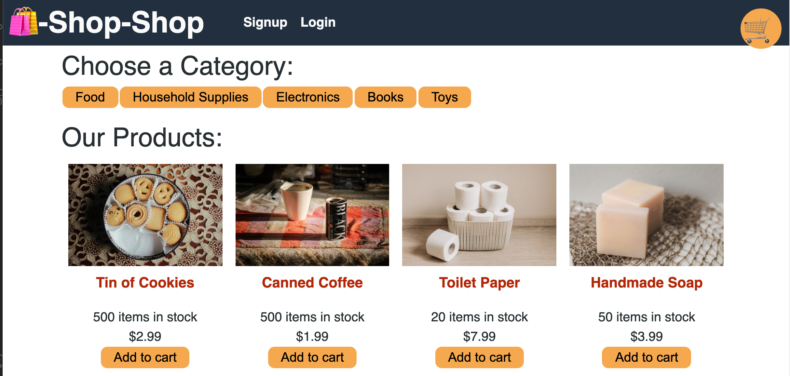

# shop-shop

## Description
This is an e-commerce platform where users can "purchase" items (items not really for sale) by adding them to their cart and checking out. It was refactored to manage state with Redux instead of ContextAPI. 

## Table of Contents
* [Installation](#installation)
* [Usage](#usage)
* [Credits](#credits)
* [License](#license)
* [Contributing](#contributing)
* [Questions](#Questions)
  

## Installation
Instructions:
Visit (https://rocky-meadow-52506.herokuapp.com/) and sign up for an account. Then you may add products to the shopping cart, and check out when ready. 

## Usage
Once you have signed up and/or logged in, you may add products to the shopping cart, and check out when ready. 

## Credits
Many thanks to Aliff Macapinlac and Megan Close (https://github.com/MeganClo); also stackoverflow.com. 

## License
Project covered under [MIT license](https://choosealicense.com/licenses/mit/).

## Contributing
If you have any ideas, just open an issue and tell me what you think.
If you'd like to contribute, please fork the repository and make changes as you'd like. Pull requests are warmly welcome.